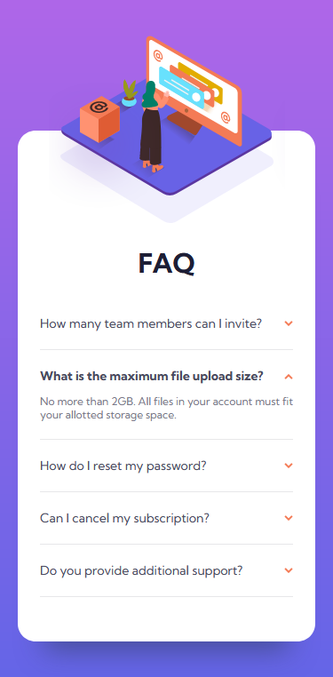
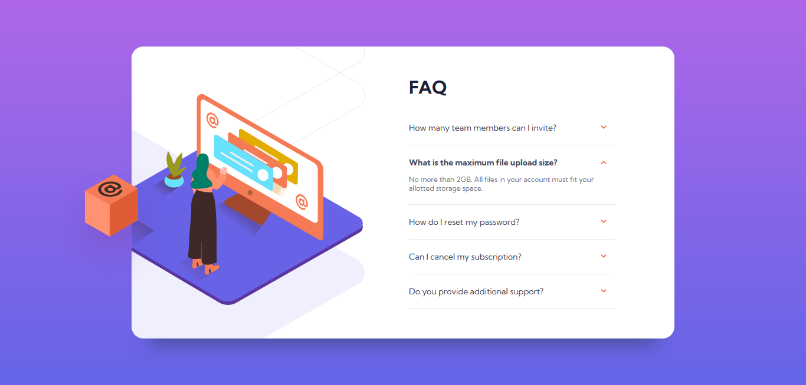

# Frontend Mentor - FAQ accordion card solution

This is a solution to the [FAQ accordion card challenge on Frontend Mentor](https://www.frontendmentor.io/challenges/faq-accordion-card-XlyjD0Oam). Frontend Mentor challenges help you improve your coding skills by building realistic projects. 

## Table of contents

- [Overview](#overview)
  - [The challenge](#the-challenge)
  - [Screenshots](#screenshots)
  - [Links](#links)
- [My process](#my-process)
  - [Built with](#built-with)
  - [What I learned](#what-i-learned)
- [Author](#author)

## Overview

### The challenge

Users should be able to:

- View the optimal layout for the component depending on their device's screen size
- See hover states for all interactive elements on the page
- Hide/Show the answer to a question when the question is clicked

### Screenshots




### Links

- Solution URL: [https://github.com/exenestecnico/fm-faq-accordion](https://github.com/exenestecnico/fm-faq-accordion)
- Live Site URL: [https://exenestecnico.github.io/fm-faq-accordion/](https://exenestecnico.github.io/fm-faq-accordion/)

## My process

### Built with

- Semantic HTML5 markup
- Flexbox
- Mobile-first workflow

### What I learned

Practiced making the accordion without using javascript. The open/closed state is modeled using hidden checkboxes.

Using a `<label>` with the title inside allows toggling the checkbox.

```html
<li class="accordion-item">
  <input type="checkbox" id="item1">
  <div class="accordion-item-header">
    <label for="item1">
      <span>How many team members can I invite?</span>
      <div class="incon-arrow-down"></div>
    </label>
  </div>
  <div class="accordion-item-body">
    <p>You can invite up to 2 additional users on the Free plan. There is no limit on team members for the Premium plan.</p>
  </div>
</li>
```

Then the **CSS** uses the *checked* state of the checkbox to modify the item header and body.

```css
.accordion-item input[type="checkbox"]:checked ~ .accordion-item-header label {
  font-weight: 700;
}

.accordion-item input[type="checkbox"]:checked ~ .accordion-item-header label .incon-arrow-down {
  transform: rotateX(180deg);
}

.accordion-item input[type="checkbox"]:checked ~ .accordion-item-body {
  max-height: 80px;
  opacity: 1;
}
```

## Author

- Frontend Mentor - [@evilhaxor](https://www.frontendmentor.io/profile/evilhaxor)
- freeCodeCamp - [@haxor](https://www.freecodecamp.org/haxor)
